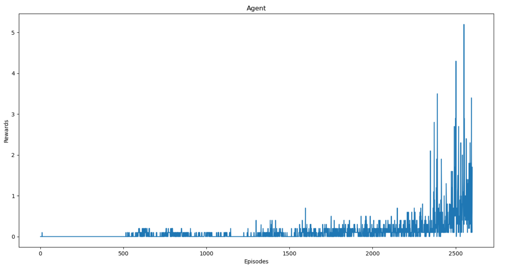

# Multi-Agent-Reinforcement-Learning

Multi-agent reinforcement learning is a challenging task as multiple agents need to be trained in an environment. In this environment we will be training 2 agents in a competitive setting. Both the agents were trained using the Deep Deterministic Policy Gradients algorithm. This algorithm is an extension of actor-critic methods to continuous action space. These models directly map input states to actions instead of outputting a probability distribution over discrete actions spaces.

# Unity ML-Agents

Unity Machine Learning Agents were developed by unity to provide game and simulation environments as training grounds for reinforcement learning. It is an open source plugin which contains already built environments along with the capacity to allow users to create their own environments. In this repository, an environment made by Udacity is used. There won't be a need to download Unity for this project. The implementation won't work with the latest Unity ML-Agents. To reproduce the results, you will need to use this environment.
In this environment two agents play tennis against each other. The goal of the agents is to keep the ball in play as long as possible. 


# Results

The environment is considered solved if any one of the agents get an average reward of 0.5 or more over 100 episodes. My agents solved the episode in 2600 episodes.


# Dependencies

python == 3.6

pytorch == 0.4.0

cudatoolkit == 11.0 (Only needed if training on GPU)

# How to use my code

You will first need to install unityagents provided in this repo. To do that run in terminal - 
```
!pip -q install ./python
```

This command needs to be run only once. After that you don't need to run this again.

To train the agent from scratch run -
```
python main.py
```

This will start the training. If you wish to change network parameters or other hyperparameters you will have to use a python IDE of your choice and change the **main.py** and/or **networks.py** files. Once, the training is completed the model will be saved in the folder **trained_models**.

This repo contains a trained model. To watch a random agent or a smart agent play -
```
python random_agent.py
```
```
python smart_agent.py
```
